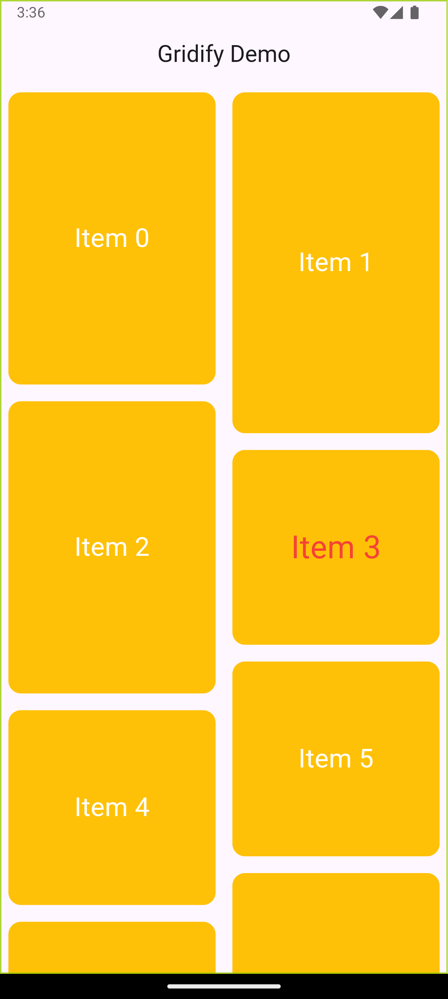

# Gridify

A Flutter package to create a dynamic staggered grid layout with custom item heights, padding, scaling, and more. `Gridify` is designed to simplify creating visually appealing layouts for your Flutter applications.

---

## Features

- Dynamic staggered grid layout.
- Customizable item heights.
- Padding, scaling, and color customization.
- Easy-to-use builder pattern for generating items.

---
## Demo

To see `Gridify` in action, view the demo image below:

<div style="display: flex; justify-content: center; align-items: center;">
  
</div>

---

## Installation

Add `gridify` to your `pubspec.yaml`:

```yaml
dependencies:
  gridify: ^1.0.0
```

Then run:

```sh
flutter pub get
```

---

## Usage

Here's a simple example of using `Gridify`:

```dart
import 'package:flutter/material.dart';
import 'package:gridify/gridify.dart';

void main() {
  runApp(const MyApp());
}

class MyApp extends StatelessWidget {
  const MyApp({super.key});

  @override
  Widget build(BuildContext context) {
    return const MaterialApp(
      debugShowCheckedModeBanner: false,
      home: MyHomePage(),
    );
  }
}

class MyHomePage extends StatelessWidget {
  const MyHomePage({super.key});

  @override
  Widget build(BuildContext context) {
    return Scaffold(
      body: Center(
        child: Gridify(
          itemCount: 10,
          builder: (context, index) => Center(
            child: Text(
              "Item $index",
              style: const TextStyle(fontSize: 18, color: Colors.white),
            ),
          ),
          padding: const EdgeInsets.all(8),
          borderRadius: BorderRadius.circular(12),
          color: Colors.blue,
          scale: 0.8,
          ontap: () {
            debugPrint('Item tapped!');
          },
        ),
      ),
    );
  }
}
```

---

## API Reference

### **`Gridify` Constructor**

```dart
Gridify({
  required int itemCount,
  required Widget Function(BuildContext, int) builder,
  EdgeInsetsGeometry? padding,
  double? scale,
  Color? color,
  BorderRadiusGeometry? borderRadius,
  required VoidCallback ontap,
})
```

#### **Parameters**

- `itemCount`: The total number of items in the grid.
- `builder`: A function to build each item.
- `padding`: Optional padding around each grid item.
- `scale`: Optional scaling factor for item heights.
- `color`: Background color of grid items.
- `borderRadius`: Border radius for each grid item.
- `ontap`: Callback when an item is tapped.


---

## Contributing

Feel free to contribute by submitting issues or pull requests on GitHub.

## License

This package is open-sourced under the MIT License.
